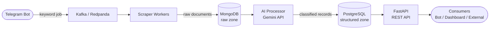

# Voice

> A public opinion & sentiment tracker — collect, classify, and serve what the world is saying about any topic.

---

## Overview

**Voice** is a portfolio project built to demonstrate end-to-end data engineering skills. It collects public opinion from news sites and social media (no login required), runs AI-powered sentiment and stance classification, and exposes the results through a REST API. Users trigger searches via a Telegram bot by submitting a keyword.

The goal is not just to build a working system, but to design one that is extensible, observable, and honest about its limitations — qualities that matter in production data engineering work.

---

## Key Features

- **Keyword-driven searches** triggered through a Telegram bot interface
- **Plugin-based source registry** — adding a new scraper requires only one new file, with zero changes to the pipeline
- **Dual-storage architecture** — raw data preserved in MongoDB; structured, queryable results in PostgreSQL
- **Async AI classification** via Gemini API (sentiment + stance per article/post)
- **REST API** to query aggregated results by keyword, source, date, or sentiment
- **Decoupled pipeline** via Kafka/Redpanda message queue for resilience and horizontal scaling

---

## Architecture



**Data flow in plain English:**
1. A user sends a keyword to the Telegram bot.
2. The bot publishes a search job to the Kafka topic.
3. Scraper workers consume the job and fetch content from registered source plugins (news sites, Reddit, etc.).
4. Raw documents are stored as-is in MongoDB for traceability.
5. The AI processor reads from MongoDB, calls Gemini for sentiment/stance classification, and writes structured records to PostgreSQL.
6. The FastAPI layer serves query results to any consumer (the bot, a dashboard, or direct API clients).

---

## Tech Stack

| Component | Technology | Rationale |
|---|---|---|
| Language | Python | Dominant in data engineering; rich ecosystem for scraping, ML, and APIs |
| Bot interface | python-telegram-bot | Simple, well-documented; Telegram bots need no hosting for the client side |
| Message queue | Kafka (or Redpanda) | Decouples ingestion from processing; Redpanda is a lighter drop-in for local dev |
| Raw storage | MongoDB | Schema-flexible; ideal for heterogeneous scraped documents with no fixed shape |
| Structured storage | PostgreSQL | ACID-compliant; well-suited for aggregated, queryable sentiment records |
| AI classification | Gemini API (free tier) | Capable LLM available without cost barrier; swappable via an abstraction layer |
| API layer | FastAPI | Async, typed, auto-documents via OpenAPI; production-grade with minimal boilerplate |
| Scheduling (later) | Apache Airflow | Industry-standard orchestrator for scheduled pipeline runs |

---

## Project Structure

```
voice/
├── shared/                     # Code shared by 2+ services
│   ├── config.py               # Loads .env via pydantic-settings; single source of truth for all env vars
│   ├── db.py                   # MongoDB and PostgreSQL connection helpers
│   └── schemas.py              # Shared TypedDicts (RawDocument, ClassifiedDocument)
├── sources/                    # Plugin-based scrapers
│   ├── __init__.py             # BaseSource abstract class + imports all plugins so decorators fire on import
│   ├── registry.py             # @register_source decorator + get_all_sources()
│   └── news/                   # Category subdirectory — one folder per source type (news, reddit, …)
│       └── detik.py            # One file per source plugin
├── bot/
│   └── main.py                 # python -m bot.main
├── api/
│   └── main.py                 # uvicorn api.main:app
├── worker/
│   └── main.py                 # python -m worker.main  (Kafka consumer → scraper)
├── processor/
│   └── main.py                 # python -m processor.main  (Mongo → Gemini → Postgres)
├── Dockerfile                  # Single image used by all app services
├── docker-compose.yml          # Orchestrates infra (Mongo, Postgres, Redpanda) + app services
├── requirements.txt            # Single shared requirements file (split per-service later if needed)
├── .env.example
└── README.md
```

**Source plugin contract** — every source implements three methods and self-registers:

```python
from sources import BaseSource
from sources.registry import register_source

@register_source("detik")
class DetikSource(BaseSource):
    def fetch(self, keyword: str) -> list[dict]:
        ...

    def process(self, data: dict, **kwargs) -> list[dict]:
        ...

    def output(self, data: dict, **kwargs) -> None:
        ...
```

No other file needs to be modified. The pipeline discovers registered sources automatically via `sources/__init__.py`.

---

## Setup & Installation

> **Coming soon.** The project is currently in Phase 0 (setup & foundations). Installation instructions, environment variables, and Docker Compose setup will be added as the implementation progresses.

---

## Roadmap

| Phase | Name | Description |
|---|---|---|
| 0 | Foundation | Project scaffolding, tooling, local dev environment |
| 1 | Scraping Core | BaseSource interface, plugin registry, first 2–3 source plugins |
| 2 | Pipeline Integration | Kafka integration, MongoDB storage, end-to-end raw flow |
| 3 | AI Classification | Gemini-powered sentiment/stance processor, PostgreSQL storage |
| 4 | API & Bot | FastAPI endpoints, Telegram bot wired to full pipeline |
| 5 | Hardening | Error handling, retries, monitoring, basic test coverage |
| 6 | NLP Intent Parsing | Natural-language keyword extraction from bot messages |
| 7 | Scheduling | Airflow DAGs for periodic keyword re-runs |

---

## Ethical Notes

This project collects and analyzes public discourse on potentially sensitive topics. The following principles apply to its design and any public-facing output:

**Transparency of methodology**
Results are derived from a limited set of sources and a single AI model (Gemini). Methodology, source list, and classification prompts will be documented and versioned so results can be independently scrutinized.

**Known limitations and bias**
- Source coverage is partial by design — only no-login-required public sources are scraped.
- AI classification reflects the biases present in the underlying model and in the prompt design.
- Results represent *indexed opinion*, not population-representative opinion.
- Non-English content may be classified less accurately.

Any output from this system should be interpreted as a signal, not a ground truth.

**Anonymization**
No user-identifying information is collected or stored. For social media sources (e.g. Reddit), author identifiers are dropped before the structured storage stage and are never exposed through the API.

**No malicious use**
This system is not designed for, and must not be used for, mass surveillance, targeted harassment, or political manipulation. Scraping respects `robots.txt` and rate limits.

---

## License

> License TBD. Placeholder — a permissive open-source license (e.g. MIT) will be chosen before the project is made public.
