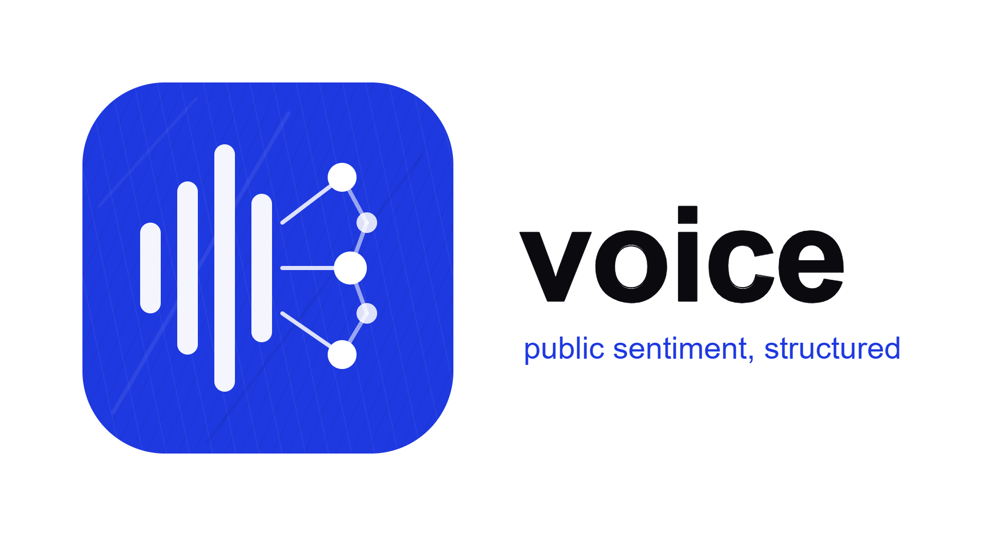
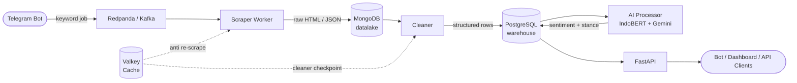

<div align="center">
  

  <br/>
  <br/>

  <p>
    
    
    
    
    
  </p>

  <p><em>Public opinion & sentiment tracker — built as a data engineering portfolio project.</em></p>
</div>

---

## Overview

**Voice** collects public opinion from news sites and social media (no login required), classifies sentiment using a hybrid AI pipeline (local IndoBERT + Gemini fallback), and exposes results through a REST API. Users trigger searches via Telegram by sending a keyword.

Designed to demonstrate end-to-end data engineering: raw ingestion → structured cleaning → AI enrichment → queryable API — all decoupled, observable, and extensible.

---

## Architecture



**Data flow:**
1. A keyword arrives at the Telegram bot and is published as a job to Redpanda.
2. The scraper worker fetches content from all registered source plugins and stores **raw** HTML/JSON in MongoDB (datalake — insert-only, no mutations).
3. A Valkey (Redis-compatible) cache keyed on the URL's MD5 prevents re-scraping the same content.
4. The **Cleaner** reads from MongoDB, parses the raw payload per source, and writes clean structured rows to PostgreSQL.
5. The **AI Processor** classifies unprocessed comments: IndoBERT handles the bulk (local, free, no rate limit), Gemini handles low-confidence and stance-complex cases.
6. FastAPI exposes aggregated results — queryable by keyword, source, date, or sentiment.

---

## Key Features

- **Keyword-driven** search triggered via Telegram bot
- **Raw-first pipeline** — raw HTML/JSON preserved in MongoDB for full reprocessability; cleaning and AI are separate idempotent passes
- **Plugin-based source registry** — one new file = one new source, zero changes to the pipeline
- **Hybrid AI** — local IndoBERT for bulk classification, Gemini API (free tier) as fallback for hard cases
- **Anti re-scrape cache** — Valkey tracks scraped URLs so repeated jobs are efficient
- **Broker flexibility** — Redpanda (lightweight, dev-friendly) or Kafka (production-grade) selectable via a single env var

---

## Tech Stack

| Layer | Technology | Notes |
|---|---|---|
| Language | Python 3.11+ | All services, single repo |
| Bot | python-telegram-bot | Keyword input; no NL intent parsing yet |
| Message queue | Redpanda / Kafka | `BROKER_TYPE=redpanda\|kafka` — kafka-python works with both |
| Datalake | MongoDB 7 | Raw HTML/JSON, insert-only, WiredTiger cache capped at 512MB |
| Cache | Valkey 8 (Redis-compatible) | Anti re-scrape + cleaner checkpoint |
| Warehouse | PostgreSQL 16 | Cleaned content + sentiment results |
| AI — bulk | IndoBERT (local) | Free, no rate limit, runs offline |
| AI — fallback | Gemini API (free tier) | Used only for low-confidence / stance-complex cases |
| API | FastAPI | Async, OpenAPI autodocs |
| YouTube data | Piped (self-hosted) | No API key required, returns search + comments |
| Scheduling (future) | Apache Airflow | Phase 7, not in MVP |

---

## Project Structure

```
voice/
├── bot/
│   └── main.py                 # Telegram bot — publishes keyword jobs to Redpanda
├── worker/
│   └── main.py                 # Kafka consumer → runs scraper pipeline
├── processor/
│   ├── main.py                 # Cleaner + AI loop (runs every 30s)
│   ├── cleaner.py              # Mongo → parse per source → PostgreSQL
│   └── ai.py                   # Sentiment stub (IndoBERT + Gemini, TODO)
├── sources/
│   ├── __init__.py             # BaseSource abstract class + plugin imports
│   ├── registry.py             # @register_source decorator
│   ├── news/
│   │   └── detik.py            # Detik source plugin
│   └── socmed/
│       └── youtube.py          # YouTube source plugin (via Piped)
├── shared/
│   ├── config.py               # pydantic-settings — all config from .env, no hardcoded defaults
│   ├── kafka/                  # Producer + Consumer wrappers
│   ├── mongodb/                # Mongo connection + insert/find helpers
│   ├── postgresql/             # ThreadedConnectionPool + DDL + typed helpers
│   ├── redys/                  # Valkey client — cache_exists, cache_set, checkpoint
│   └── utils/
│       ├── logger.py           # Loguru + stdlib unification via InterceptHandler
│       ├── monitor.py          # Rich Live progress bars (split or unified panels)
│       ├── network.py          # Async HTTP with retries
│       ├── endecode.py         # MD5/SHA hash, base64, XOR cipher, URL encode, etc.
│       └── search.py           # JMESPath wrapper
├── docker-compose.yml          # Core infra always-on; broker via --profile redpanda|kafka
├── requirements.txt
└── .env.example
```

---

## Source Plugin Contract

Adding a new source = one new file, no changes to the pipeline:

```python
from sources import BaseSource
from sources.registry import register_source

@register_source("mysource")
class MySource(BaseSource):
    async def collect_urls(self, keyword: str, interval: str) -> list[dict]:
        """Return list of {url, title, media, desc, date} dicts."""
        ...

    async def fetch_detail(self, content: dict) -> dict:
        """Return content dict with article_id and raw fields added."""
        ...

    async def fetch_comments(self, content: dict) -> list[dict]:
        """Return list of raw API objects (one → one MongoDB document)."""
        ...
```

`BaseSource.process()` handles the full orchestration: concurrent detail fetching, Valkey cache checking, MongoDB saves, comment gathering, and progress display.

---

## Setup

### Prerequisites

- Docker Desktop
- Python 3.11+

### 1. Start infrastructure

```bash
# Redpanda (default — lightweight, Kafka-compatible)
docker compose --profile redpanda up -d

# Or Kafka (production-grade)
docker compose --profile kafka up -d

# Add YouTube support (Piped — requires piped/config.properties)
docker compose --profile piped up -d
```

Core services (MongoDB, PostgreSQL, Valkey) always start regardless of profile.

### 2. Configure environment

```bash
cp .env.example .env
# Edit .env with your values
```

Key variables:

| Variable | Description |
|---|---|
| `BROKER_TYPE` | `redpanda` or `kafka` |
| `REDPANDA_BROKER` | e.g. `localhost:19092` |
| `MONGO_URI` | MongoDB connection string |
| `POSTGRES_DSN` | PostgreSQL DSN |
| `VALKEY_URL` | e.g. `redis://localhost:6379/0` |
| `PIPED_BASE_URL` | Piped backend URL for YouTube |
| `GEMINI_API_KEY` | Gemini API free tier key |
| `TELEGRAM_BOT_TOKEN` | From @BotFather |

### 3. Run services

```bash
# Scraper worker
python -m worker.main

# Processor (cleaner + AI)
python -m processor.main

# Telegram bot
python -m bot.main
```

---

## Roadmap

| Phase | Status | Name | Description |
|---|---|---|---|
| 0 | ✅ Done | Foundation | Project scaffolding, tooling, local dev environment |
| 1 | ✅ Done | Scraping Core | BaseSource, plugin registry, Detik + YouTube plugins |
| 2 | ✅ Done | Pipeline Integration | Redpanda/Kafka, MongoDB datalake, Valkey cache, raw-first flow |
| 3 | 🔄 In Progress | Cleaning & AI | Cleaner service, IndoBERT + Gemini sentiment processor |
| 4 | ⏳ Planned | API & Bot | FastAPI endpoints, Telegram bot wired to full pipeline |
| 5 | ⏳ Planned | Hardening | Retries, observability, basic test coverage |
| 6 | ⏳ Planned | NLP Intent | Natural-language keyword extraction from bot messages |
| 7 | ⏳ Planned | Scheduling | Airflow DAGs for periodic keyword re-runs |

**MVP target: 17 Jun – 18 Aug 2026** (Phases 0–4, ~6–10 hrs/week)

---

## Ethical Notes

**Transparency** — Methodology, source list, and classification prompts are versioned and documented so results can be independently scrutinized.

**Known limitations**
- Coverage is partial — only no-login-required public sources are scraped
- AI classification reflects biases in the underlying models and prompt design
- Results represent *indexed opinion*, not population-representative opinion

**Privacy** — No user-identifying information is stored. Author identifiers are dropped before the structured storage stage and are never exposed via the API.

**Responsible use** — This system must not be used for mass surveillance, targeted harassment, or political manipulation. Scraping respects `robots.txt` and source rate limits.

---

## License

MIT — see [LICENSE](LICENSE)
