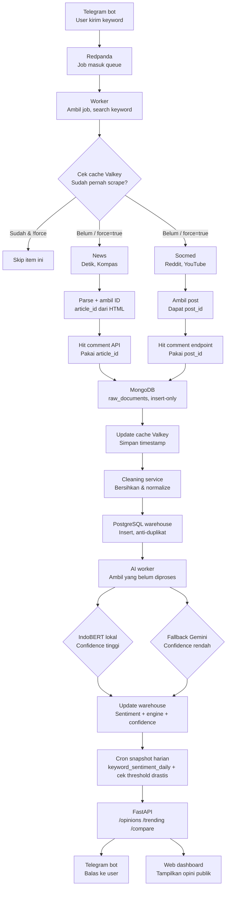

# Voice - pipeline flow

Dokumentasi alur end-to-end Project Suara: dari keyword yang di-submit lewat Telegram bot, sampai hasil sentiment tampil di API dan web dashboard.

## Diagram

## Penjelasan tiap tahap

### 1. Ingestion

- **Telegram bot** — user kirim keyword pencarian, opsional flag `force` buat re-scrape data yang udah pernah diambil.
- **Redpanda** — bot push job ke topic, Kafka-API compatible, lebih ringan dari Kafka asli buat dev di laptop.
- **Worker (consumer)** — ambil job dari queue, search keyword ke source yang relevan, dapet list kandidat artikel/post.

### 2. Cache check (Valkey)

- Per kandidat, cek apakah `source_id`/`url` udah ada di cache.
- Sudah ada & `force=false` → skip, gak discrape ulang.
- Belum ada, atau `force=true` → lanjut ke scraping.
- Valkey juga dipakai cleaning service buat checkpoint (`clean:last_checkpoint`), namespace dipisah dari cache anti-rescrape (`scrape:cache:*`).

### 3. Scraping — bercabang per kategori sumber

**News** (Detik, Kompas — berbasis HTML):

1. Scrape halaman artikel → parse → dapet `title`, `content`, `published_at`, dan `article_id`
2. Pakai `article_id` buat hit comment API (GraphQL, khusus Detik)

**Socmed** (Reddit, YouTube — berbasis API resmi):

1. Hit API → dapet post/video beserta `post_id`
2. Pakai `post_id` buat hit comment endpoint

### 4. Datalake (MongoDB)

- Collection tunggal `raw_documents`, insert-only — gak ada field status di dalamnya.
- Artikel/post dan comment-nya disimpan di collection yang sama, dibedain lewat `type` (`article`/`post`/`comment`) dan `parent_id`.
- Field `raw` nyimpen payload paling mentah (HTML container atau JSON API asli) buat reprocessing kalau logic parsing berubah.

### 5. Cleaning → warehouse (PostgreSQL)

- Cleaning service baca dokumen baru dari Mongo (berdasar checkpoint di Valkey), bersihin & normalize.
- Insert ke PostgreSQL pakai `UNIQUE` constraint di `source_id` + `ON CONFLICT DO NOTHING` — safety net kalau checkpoint kebobolan/restart.

### 6. AI processing

- Worker ambil row warehouse `WHERE type != 'article' AND ai_processed = false` (artikel dianggap konteks, gak dianalisis sentimennya).
- Klasifikasi pakai IndoBERT lokal dulu; kalau confidence rendah, fallback ke Gemini.
- Update kolom `sentiment`, `engine` (lokal/gemini), `confidence`, `ai_processed=true`.

### 7. Agregasi & serving

- Cron harian bikin snapshot ke tabel `keyword_sentiment_daily`, sekaligus cek threshold perubahan drastis per keyword.
- FastAPI serve `/opinions`, `/trending`, `/compare` dari warehouse.
- Telegram bot dan web dashboard sama-sama konsumsi API yang sama buat nampilin hasil ke user.

## Catatan desain

- **Mongo = datalake** (raw, insert-only) — **Postgres = warehouse** (bersih, ada sentiment).
- Artikel/post = konteks (gak dikasih skor sentimen individual); comment & post = opini individual, dihitung satu-satu, gak digabung jadi satu skor per artikel.
- Tiga flag status, tiga concern berbeda: Valkey (`scrape:cache`) = anti re-scrape, Postgres `ai_processed` = anti re-classify. Mongo sendiri gak punya flag status sama sekali.
